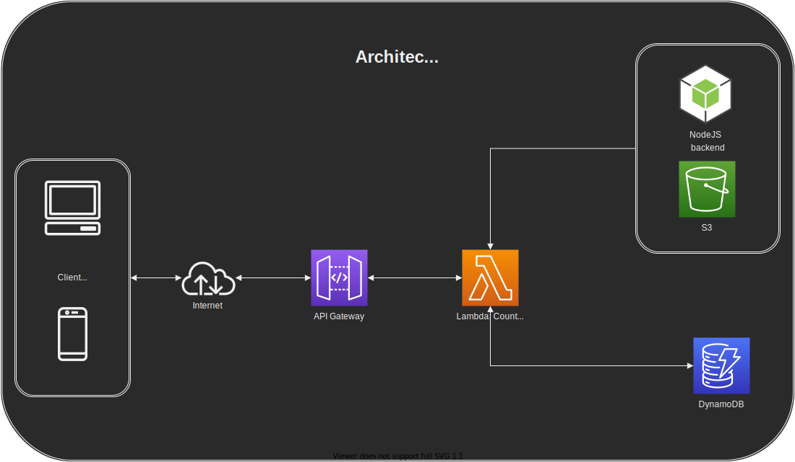

# Views Counter
Contador de visualizações

## Descrição
Incrementar um contador de visualização de página e ter como pegar esse valor de quantidade de visualizações

Além de contar as visualizações, deve-se conseguir cadastrar usuário e mostrar os dados do usuário cadastrado.

1. Incrementar o número de acessos;
2. Consultar o número de acessos;
3. Criar um usuário;
4. Visualizar as informações de um usuário.

## Arquitetura
O projeto foi pensado para utilizar serviços da AWS como DynamoDB, S3, API Gateway usando o [Serverless](https://www.serverless.com/), conforme mostra o diagrama abaixo.



## Instalação
Primeiramente você deve ter/fazer a instalação do [AWS CLI](https://aws.amazon.com/cli/) configurando em sua máquina. Em seguida realizar o clone do projeto para a sua máquina para então execute a instalação dos pacotes.
```bash
npm install
```

Para realizar o deploy para a AWS
```bash
sls deploy
```

Para executar local a API
```
npm start
```

## Uso
Para utilizar a API você pode executar tanto local quanto na AWS

URL AWS: 
URL Local: https://localhost:3000/

---

## Rotas

### Contador
#### GET - Visualizar contagem
Path: `/count-viewer`

Response
```json
{
	"status": 200,
	"path": "helcio/penha",
	"value": 9
}
```

#### POST - Incrementar contador
Path: `/count-viewer`

Ele sempre incrementa +1.


### Usuários
#### POST - Cadastrar usuário
Path: `/users`

Enviar no Body
```json
{
  "email": "johndoe@email.com",
  "name": "John Doe",
  "username": "johndoe",
	"password": "123456"
}
```

#### GET - Pegar usuário por ID
Path: `/users/:idUser`

Response
```json
{
	"userId": "f68cd0b4-a8f8-45b0-b910-16ba50397153",
	"email": "johndoe@email.com",
	"name": "John Doe",
	"username": "johndoe",
	"created_at": "2022-04-01T05:53:09.080Z",
	"updated_at": "2022-04-01T05:53:09.080Z"
}
```

#### GET - Listar todos os usuários
Path: `/users`

Response
```json
[
	{
		"updated_at": "2022-04-01T11:51:10.114Z",
		"created_at": "2022-04-01T11:51:10.114Z",
		"userId": "920430f9-6e8f-424e-b93e-5d29872bab11",
		"username": "johndoe",
		"email": "johndoe@email.com",
		"name": "John Doe"
	},
	{
		"updated_at": "2022-04-01T11:49:34.192Z",
		"created_at": "2022-04-01T11:49:34.192Z",
		"userId": "35ecada1-7efa-49f0-b93d-a82d7abb0621",
		"username": "joaomaria",
		"email": "joaomaria@test.com",
		"name": "Joao Maria"
	}
]
```